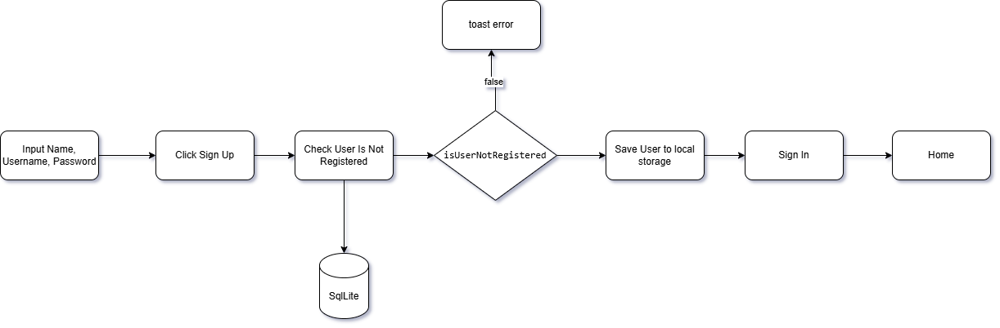
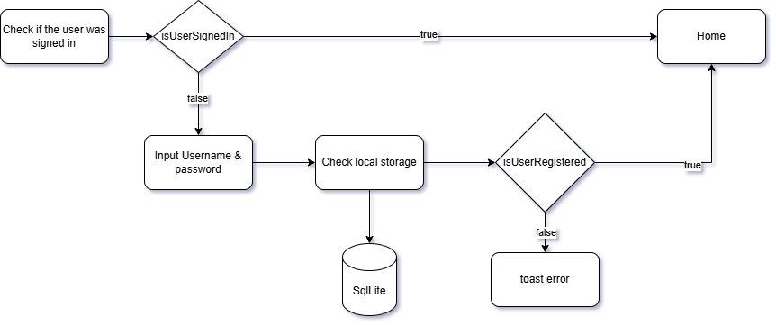
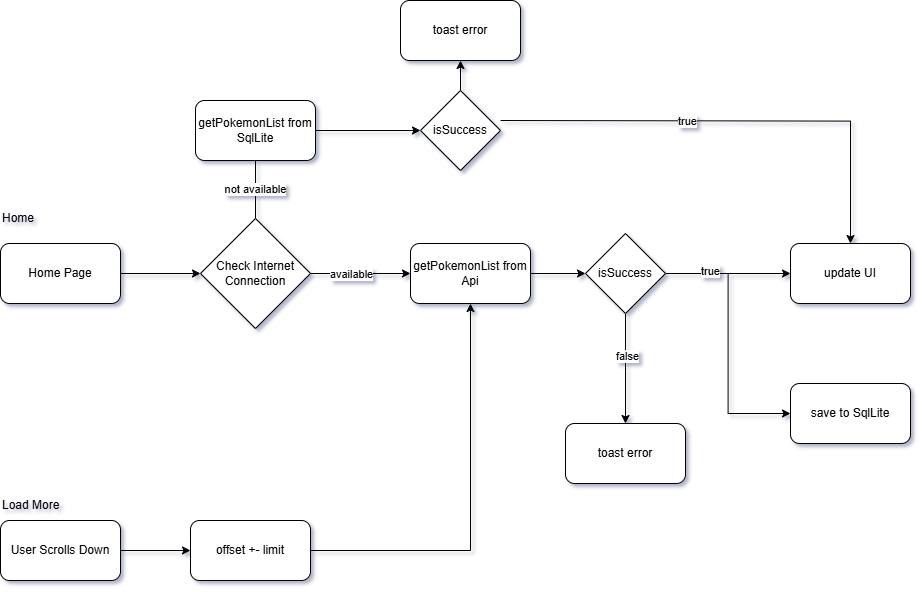

# 🧪 Technical Test - PokeList

This is an Android project developed as part of a **technical test**. The application fetches and displays Pokémon data using the [PokeAPI](https://pokeapi.co).

---

# ▶️ [Watch the video](assets/demo.mp4)

---
## 🛠️ Tech Stack

- **Architecture**: Clean Architecture with **Domain-Driven Design (DDD)**
- **Dependency Injection**: [Hilt](https://developer.android.com/training/dependency-injection/hilt-android)
- **API**: [PokeAPI](https://pokeapi.co)
- **Language**: Kotlin

---

## 📱 Features

- User Registration
- User Sign In
- Pokémon List
- Pokémon Detail

---

## 🔁 Application Flow

Below are flow diagrams representing the main flows of the application:

### 🔐 Register Flow


### 🔓 Sign In Flow


### 🏠 Home Flow


> All diagrams are stored in the `assets/` folder.

---

## 🏗️ Project Structure (Clean Architecture + DDD)
```text
├── data
│   └── repository, remote, local
├── domain
│   └── model, repository, usecase
├── presentation
│   └── ui, viewmodel
├── di
│   └── Hilt modules
└── MainApplication.kt
